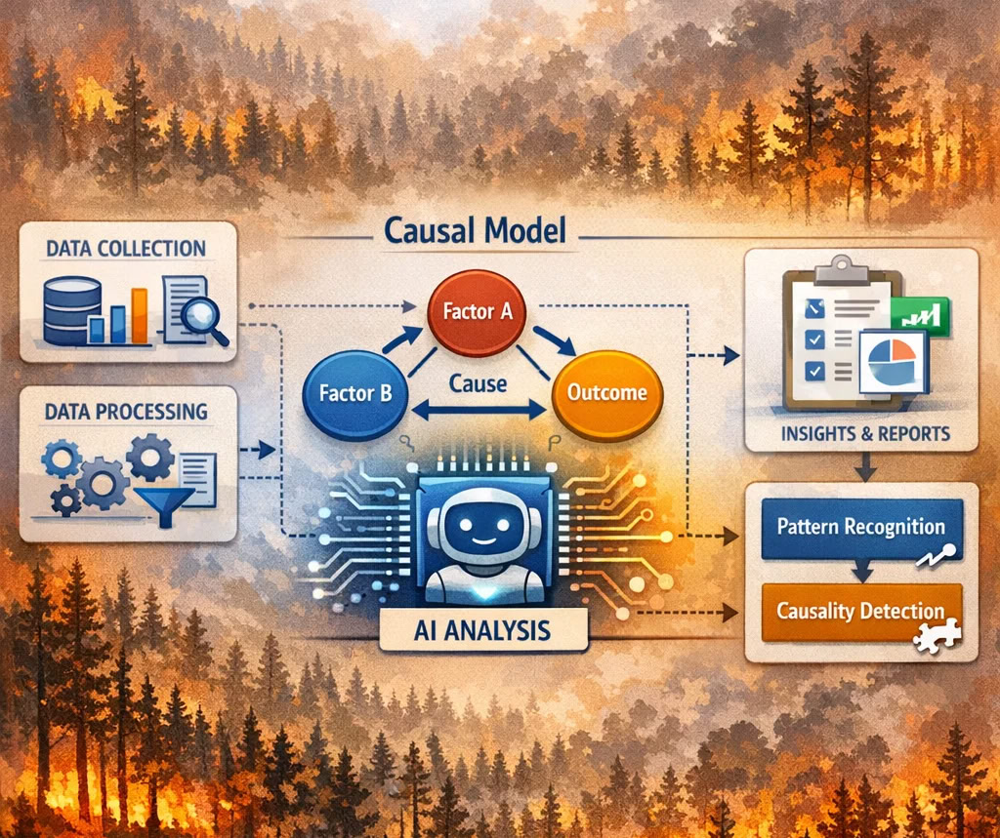

# ИИ и поиск причин 🤖🔍

Современный искусственный интеллект способен не просто обрабатывать большие массивы данных, но и **выявлять причинно-следственные связи**. Это позволяет нам понимать, **почему события происходят**, предсказывать последствия решений и оптимизировать процессы в самых разных сферах — от экономики до медицины. В этой статье мы рассмотрим, как ИИ анализирует причины, почему это важно и какие преимущества даёт подобный подход.

---

## Принцип работы ИИ в поиске причин 🧠

ИИ использует алгоритмы машинного обучения для выявления **шаблонов и закономерностей** в данных. Однако найти корреляцию — недостаточно: нужно понять **какая переменная влияет на другую**, а где связь случайная.

### Основные этапы анализа:

* 💡 **Сбор данных** — агрегирование информации из разных источников.
* 🔄 **Обработка и фильтрация** — удаление шумов и лишней информации.
* 🚀 **Построение модели** — алгоритм выявляет возможные зависимости.
* 🎯 **Проверка гипотез** — оценка, какие связи действительно причинно-следственные, а какие — лишь совпадения.

> **Важно!** ИИ не "думает" как человек, но способен быстро обрабатывать сотни факторов, выявляя скрытые закономерности, которые трудно заметить традиционными методами.

---

## Применение ИИ для анализа причин 🌐

ИИ используется в разных сферах для понимания **почему** происходят события:

* **Экономика:** выявление причин колебания цен, прогнозирование кризисов.
* **Медицина:** определение факторов риска заболеваний и эффективности лечения.
* **Промышленность:** анализ отказов оборудования, оптимизация производственных цепочек.
* **Социология:** изучение факторов, влияющих на поведение людей и групп.

---

## Модели и методы 🔧

Существуют разные подходы, позволяющие ИИ искать причинно-следственные связи:

| Метод                  | Особенности                                                   | Применение                         |
| ---------------------- | ------------------------------------------------------------- | ---------------------------------- |
| **Байесовские сети**   | Статистическая модель, показывающая вероятностные зависимости | Медицина, финансы                  |
| **Деревья решений**    | Визуализируют причинно-следственные пути                      | Бизнес-аналитика, маркетинг        |
| **Глубокие нейросети** | Выявляют сложные и нелинейные связи                           | Большие данные, прогнозирование    |
| **Метод Грэнджера**    | Проверка временных рядов на причинность                       | Экономика, социальные исследования |

> ИИ помогает **не просто предсказывать результат**, но и понимать механизм, который его порождает. Это делает решения более обоснованными и стратегически верными.

---

## Преимущества использования ИИ 🏆

1. **Скорость и масштаб:** способен обрабатывать миллионы данных за минуты.
2. **Объективность:** снижает влияние человеческих предубеждений.
3. **Глубина анализа:** выявляет скрытые связи, которые сложно увидеть традиционными методами.
4. **Прогнозирование:** позволяет предугадывать последствия действий, минимизируя риски.

---

## Заключение 💭

ИИ — мощный инструмент для **поиска причин** в сложных системах. Он помогает нам видеть **закономерности**, предсказывать последствия решений и принимать более осознанные меры. Понимание того, **почему события происходят**, даёт преимущество как в бизнесе, так и в науке, экономике и повседневной жизни. Использование ИИ в этом контексте превращает данные в знания и знания в **эффективные действия**. 🌱

---

*Автор: Слесарчук Василий*

*Использованные нейросети: СhatGPT (GPT-5.3) для генерации текста, Sora для создания иллюстрации.*

