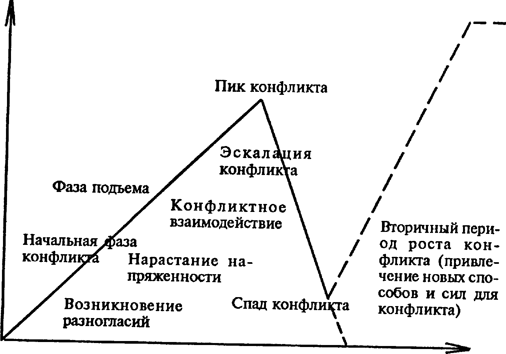

# Корни социальных конфликтов: почему мы ссоримся? 🌍⚔️

**Социальный конфликт** — это столкновение сторон, вызванное **противоречиями** в интересах, ценностях или целях. Конфликты сопровождают человечество на протяжении всей истории: от бытовых ссор до мировых войн. Но что именно лежит в их основе? В этой статье мы разберём главные причины конфликтов, роль **агрессии** и способы их разрешения через **переговоры** и **медиацию**.

---

## Что такое социальный конфликт? 🤷

В **социологии** и **психологии** конфликт определяют как процесс, в котором одна сторона осознаёт, что её интересы противоположны интересам другой. Конфликт может быть явным (открытое столкновение) или скрытым (латентным). Важно понимать, что конфликт — это не всегда зло; иногда он помогает выявить проблемы и найти новые решения.

> [!NOTE]
> Конфликт ≠ агрессия. Агрессия — это лишь одна из форм поведения в конфликте, но не обязательный его спутник.

---

## Основные корни конфликтов 🌱

Социальные конфликты возникают из множества причин. Условно их можно разделить на несколько групп. В таблице ниже представлены ключевые источники:

| Группа причин               | Примеры                                                                 |
|-----------------------------|-------------------------------------------------------------------------|
| **Несовпадение интересов** 💰 | Борьба за ресурсы (деньги, территория, власть)                         |
| **Недопонимание** 🗣️         | Разные интерпретации слов, поступков, культурные различия              |
| **Ценностные противоречия** ✝️ | Религиозные, идеологические или моральные разногласия                  |
| **Структурные факторы** 🏛️    | Неравенство, дискриминация, несправедливое распределение благ          |
| **Эмоциональные триггеры** 😤  | Обида, зависть, страх, уязвлённое самолюбие                            |

Каждая из этих причин может действовать как самостоятельно, так и в комбинации с другими. Часто конфликт начинается с **недопонимания**, а затем обрастает эмоциями и борьбой за **интересы**.

---

## Роль агрессии в конфликтах 💢

**Агрессия** — это действие, направленное на причинение вреда другому. В конфликте она может проявляться как вербально (оскорбления, угрозы), так и физически. Психологи выделяют несколько видов агрессии:

- Инструментальная — используется для достижения цели (например, шантаж).
- Враждебная — вызвана гневом и желанием навредить.
- Пассивная — скрытое сопротивление, игнорирование.

> [!CAUTION]
> **Осторожно!** Агрессия редко решает проблему — чаще она лишь разжигает конфликт и затрудняет поиск компромисса.

Исследования показывают, что склонность к агрессии зависит от воспитания, социальной среды и даже гормонального фона. Но важно помнить: агрессивное поведение можно контролировать и трансформировать.

  
*На схеме показаны этапы эскалации конфликта: от латентной стадии (накопление недовольства) до открытых столкновений и, в идеале, разрешения.*

---

## Как разрешать конфликты? 🤝

Существуют цивилизованные способы урегулирования споров. Два главных инструмента — **переговоры** и **медиация**.

### Переговоры 🗣️
Это прямой диалог сторон с целью найти взаимоприемлемое решение. Успешные переговоры включают:
- Чёткое формулирование **интересов** каждой стороны.
- Поиск общих точек соприкосновения.
- Готовность к компромиссам.

### Медиация 🕊️
Когда стороны не могут договориться самостоятельно, на помощь приходит медиатор — нейтральный посредник. Он помогает:
- Снизить эмоциональный накал.
- Услышать и понять позицию другого.
- Сформулировать варианты решения.

Медиация особенно эффективна в семейных, трудовых и межкультурных конфликтах.

> [!TIP]
> **Совет:** Если вы чувствуете, что спор заходит в тупик, предложите паузу или привлеките третьего нейтрального человека. Иногда взгляд со стороны помогает увидеть выход.

---

## Интересные факты о конфликтах ✨

- 🐒 Конфликты наблюдаются даже у животных — они борются за территорию, пищу и партнёров.
- 📉 По статистике, около 80% рабочих конфликтов возникают из-за недопонимания, а не из-за реальных противоречий.
- 🧠 Во время конфликта в мозге активируются те же зоны, что и при физической боли.
- 🌍 Самый длительный конфликт в истории — Столетняя война (на самом деле длилась 116 лет).
- 🤝 Слово «медиация» происходит от латинского *mediare* — «посредничать».

---

## Заключение 💭

**Социальные конфликты** — неизбежная часть человеческого взаимодействия. Их **корни** уходят в **противоречия**, **недопонимание** и борьбу за **интересы**. Однако важно не избегать конфликтов, а учиться управлять ими. Агрессия — лишь тупиковый путь, тогда как **переговоры** и **медиация** открывают дорогу к конструктивным решениям. Понимание причин конфликтов — первый шаг к гармоничному обществу. 😊

---
Авторы: Зарецкая Анастасия;  
*Ресурсы: LLM — DeepSeek*
