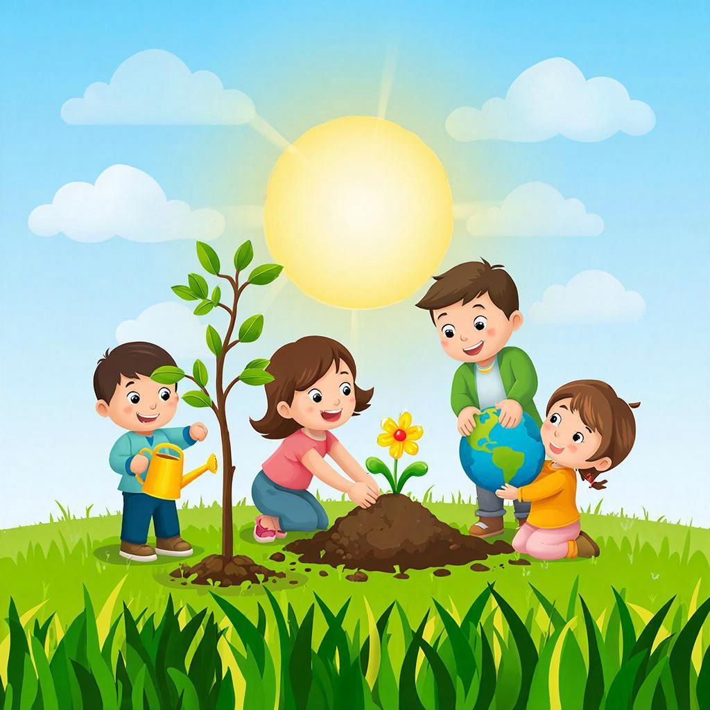

# Экологический след: Какой след оставляешь ты?

Задумывался ли ты, что происходит с фантиком от конфеты, который ты выбросил? А куда утекает вода, когда ты чистишь зубы? Все это — частички твоего **экологического следа**. Это понятие придумали ученые, чтобы измерять, как сильно каждый человек влияет на **планету**.

**Экологический след** — это количество природных **ресурсов** (воды, леса, земли), которое нужно, чтобы обеспечить нашу жизнь, и количество **отходов**, которое нужно переработать. У каждого из нас он есть: когда мы едим, ездим на машине, включаем свет или покупаем новую игрушку.

Чем больше мы потребляем и выбрасываем, тем тяжелее становится наш след. Если след всего человечества будет слишком тяжелым, **планета** может не справиться — закончатся чистый воздух и вода.

Но хорошая новость в том, что мы можем сделать свой след легче! Это и есть наша **[ответственность](./responsibility.md)** за будущее. Как?
*   Выключать воду и свет, когда они не нужны.
*   Не мусорить и сортировать отходы (бумагу, пластик).
*   Беречь вещи и дарить им вторую жизнь.
*   Сажать деревья.

Забота о природе — это забота о своем доме. Чем легче наш след, тем крепче и **устойчивее** наш общий дом — Земля.

---
*Авторы: Екатерина Афанасьева*
*Нейросети, использованные при создании: DeepSeek для генерации текста, GigaChat для создания изображения.*
