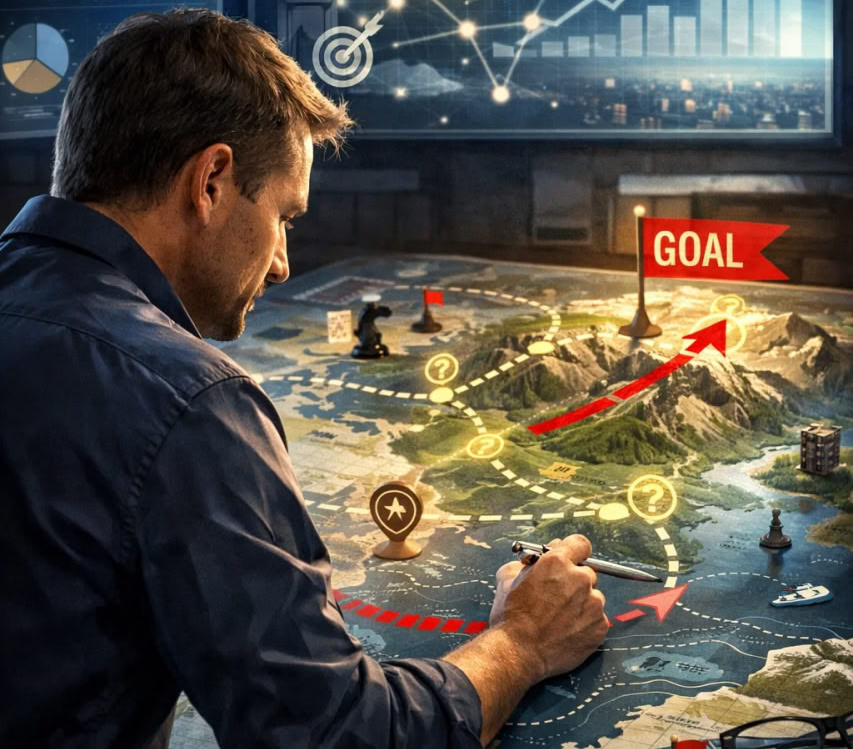

# Проектирование будущего 🚀🛠️

Будущее не просто наступает — его можно **проектировать**. Каждый шаг, каждое решение и каждый проект формируют траекторию событий, создавая последствия, которые определяют нашу жизнь и общество. **Проектирование будущего** — это сознательная работа с возможностями, понимание причинно-следственных связей и способность предвидеть результаты своих действий.

---

## Основы проектирования будущего 🧭

Проектирование будущего — это не фантазия и не предсказания наугад. Это систематическая работа с **выборами**, **ресурсами** и **возможностями**.

### Ключевые элементы:

* 💡 **Видение** — ясное понимание желаемого состояния.
* ⚙️ **Планирование** — создание пошаговой стратегии, учитывающей реальные условия.
* 🚀 **Действие** — воплощение идей в конкретные меры.
* 🎯 **Анализ последствий** — оценка результатов и корректировка курса.

> **Важно!** Без анализа последствий любое планирование превращается в набор желаний. Понимание причинно-следственных связей позволяет предсказывать, как одно действие повлияет на другие аспекты жизни и системы.

---

## Процесс стратегического проектирования 🗺️

Проектирование будущего похоже на создание карты маршрута в неизведанном мире. Каждое решение — это точка на этой карте, каждое действие — шаг по маршруту.

1. **Сбор информации** 📚 — изучение текущей ситуации и факторов, влияющих на будущее.
2. **Построение сценариев** 🔮 — моделирование различных возможных вариантов развития событий.
3. **Определение приоритетов** ⚖️ — выбор направлений с наибольшим потенциалом положительного эффекта.
4. **Реализация стратегии** 🚀 — последовательное воплощение выбранного пути.
5. **Коррекция курса** 🔄 — регулярная оценка и адаптация стратегии в зависимости от полученных результатов.

---

## Роль причинно-следственных связей ⛓️

Понимание **каскадного эффекта** действий критично для успешного проектирования. Малое изменение на начальном этапе может вызвать значительные последствия в будущем. Этот принцип напоминает **эффект домино**: один шаг запускает цепочку событий, влияя на всё, что следует дальше.

Примеры применения:

* 🌱 В экологическом планировании: изменения в одном регионе могут повлиять на климатические и экономические условия других областей.
* 🏗️ В урбанистике: проектирование инфраструктуры сегодня определяет качество жизни жителей десятилетия спустя.
* 💼 В бизнесе: стратегические инвестиции формируют конкурентные преимущества и открывают новые рынки.

---

## Практические рекомендации для проектирования будущего 🌟

* **Развивайте системное мышление** 🧠 — видение взаимосвязей между событиями и их последствиями.
* **Используйте сценарное планирование** 📊 — моделируйте разные варианты развития событий.
* **Учитывайте риски и неопределённость** ⚠️ — готовьте альтернативные пути на случай непредвиденных обстоятельств.
* **Обучайтесь на обратной связи** 🔄 — анализируйте результаты, чтобы корректировать следующие шаги.
* **Сотрудничайте** 🤝 — объединяйте знания и ресурсы, чтобы усиливать эффект действий.

---

## Заключение 💭

Проектирование будущего — это способность **создавать желаемые последствия** и управлять последствиями своих действий. Осознание причинно-следственных связей позволяет не просто реагировать на события, а **формировать их**. Чем глубже мы понимаем взаимосвязи и последствия, тем точнее можем выстраивать стратегию, минимизировать риски и создавать устойчивые результаты — для себя, для общества и для мира в целом. 🌱

---

*Автор: Слесарчук Василий*

*Использованные нейросети: СhatGPT (GPT-5.3) для генерации текста, Sora для создания иллюстрации.*

