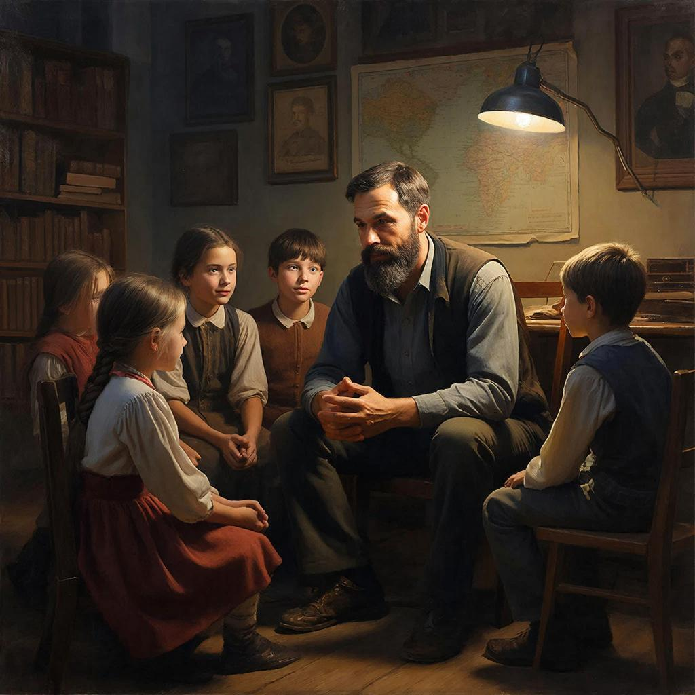

# Уроки истории: Путешествие во времени

История — это не просто скучный список дат и имен в учебнике. Это огромная книга приключений, в которой записаны дела наших бабушек, дедушек и людей, живших тысячи лет назад. Это наша общая **память**.

Зачем же нам нужна эта память? Представь, что ты впервые дотронулся до горячего чайника. Тебе было больно, и ты запомнил: «горячее — опасно». Это твой личный **урок** истории. У человечества тоже есть такие «чайники» — войны, голод, разрушения. Изучая **прошлое**, мы узнаем, какие **ошибки** привели к беде, чтобы не наступать на те же грабли в будущем. Это и есть понимание [причинно-следственных связей](./causality_base.md).

История хранится в наших **традициях**. Почему мы печем блины на Масленицу или отмечаем День Победы? Потому что так делали наши предки, передавая свой **опыт** и радость из поколения в поколение. Это ниточка, которая связывает нас с теми, кто жил раньше.

Знать историю — значит понимать настоящий мир и чувствовать себя частью чего-то большого и важного.

---
*Авторы: Екатерина Афанасьева*
*Нейросети, использованные при создании: DeepSeek для генерации текста, GigaChat для создания изображения.*
