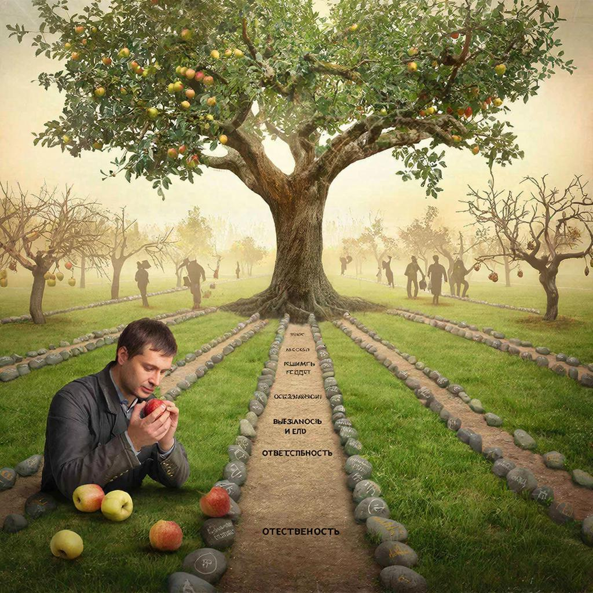

# Выбор и его плоды 🛤️🍎

В жизни каждого человека наступает момент, когда он осознает: его текущее положение — это не просто стечение обстоятельств, а результат множества принятых решений. **Личный выбор** является фундаментом, на котором строится индивидуальность. В этой статье мы исследуем, как осознанное **действие** и принятие ответственности за его **последствие** определяют наш уникальный **жизненный путь**.

---

## Природа человеческого выбора 🤔

Центральным элементом человеческого существования является **воля**. Именно она позволяет нам переходить от пассивного созерцания к активному изменению реальности. Каждое наше **решение** — это точка разветвления, где одна возможность обретает плоть, а тысячи других исчезают.

> **Важно!** Свобода выбора неразрывно связана с [ответственностью](./responsibility.md). Без осознания того, что за каждым поступком стоит конкретный результат, выбор превращается в хаотичное движение.

Согласно экзистенциальной психологии, именно способность совершать осознанный **выбор** в условиях неопределенности делает человека свободным. 

Основные компоненты выбора:
- 💡 **Осознанность** — понимание своих истинных мотивов.
- ⚖️ **Оценка** — анализ возможных альтернатив.
- 🚀 **Решимость** — готовность воплотить задуманное в жизнь.

---

## Автономия и независимость личности 🗽

Важнейшим понятием в контексте самоопределения является **автономия**. Это способность личности действовать на основе собственных убеждений, а не под давлением внешних обстоятельств или чужого мнения.

| Понятие | Роль в формировании личности |
| :--- | :--- |
| **Воля** | Внутренний «двигатель», позволяющий преодолевать сопротивление среды. |
| **Автономия** | Право и способность быть автором собственной судьбы. |
| **Действие** | Практическое воплощение внутреннего намерения в материальном мире. |

Автономная личность понимает, что даже отсутствие выбора — это тоже своего рода **решение**, за которое придется нести ответственность.

---

## Цепочка: Решение — Действие — Последствие ⛓️

Жизнь человека можно представить как непрерывную цепь причинно-следственных связей. 

1. **Решение**: Формируется во внутреннем пространстве мысли.
2. **Действие**: Переносит идею в реальный мир.
3. **Последствие**: Обратная связь от реальности, которая корректирует наш дальнейший путь.

Осознание этой связи превращает человека из «щепки в океане событий» в штурмана собственного корабля. Когда мы принимаем тот факт, что каждое **последствие** — это «плод» нашего собственного посева, наш **жизненный путь** становится более осмысленным и целенаправленным.

> «Человек — это не что иное, как ряд его поступков».  
> — **Жан-Поль Сартр**, философ-экзистенциалист

---

## Как формируется жизненный путь? 🗺️

**Жизненный путь** — это не прямая линия, а сложная траектория, состоящая из побед, ошибок и извлеченных уроков. Он формируется в тот момент, когда мы перестаем винить судьбу и начинаем анализировать свои **действия**.

* **Накопительный эффект:** Малые ежедневные решения создают инерцию, которая в долгосрочной перспективе приводит к глобальным изменениям.
* **Кризис как точка роста:** В моменты тяжелого выбора наша **воля** закаляется, а **автономия** проходит проверку на прочность.
* **Коррекция курса:** Осознание негативных последствий — это не повод для самобичевания, а ценный ресурс для принятия более мудрых решений в будущем.

---

## Заключение 💭

**Выбор и его плоды** — это бесконечный процесс самопознания. Понимая, что каждое наше **решение** оставляет отпечаток на реальности, мы учимся ценить свою **автономию** и осознанно направлять свою **волю**. В конечном итоге, наш **жизненный путь** — это самое масштабное произведение искусства, которое мы создаем каждым своим вздохом и каждым своим поступком. 😊

---

*Автор: Погожев Максим*

*Использованные нейросети: DeepGemini 2.5 Flash для генерации текста, Kandinsky для создания иллюстрации.*