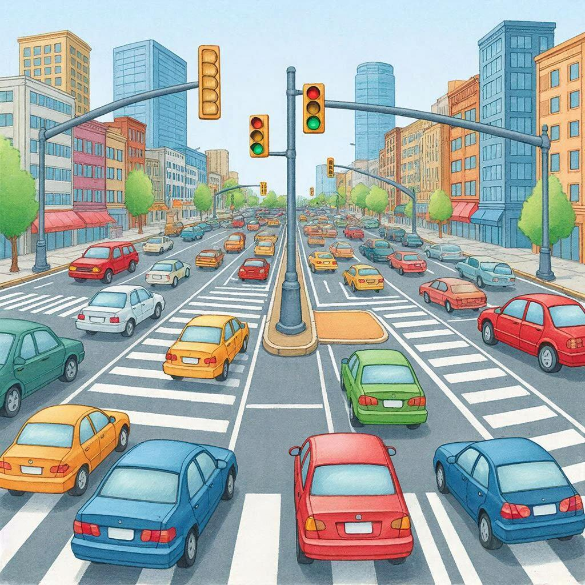

# Почему правила работают

Ты когда-нибудь задумывался, зачем нужны правила? Почему нельзя перебегать дорогу на красный свет или почему в школе нужно поднимать руку, чтобы ответить?

Правила — это не просто скучные запреты. Это очень важный механизм, который помогает нам жить вместе. Они работают, потому что делают нашу жизнь **предсказуемой**.

### 🤔 Как это работает?

Представь перекресток. Если бы правил дорожного движения не было, каждый ехал бы как хотел. Что бы случилось? Аварии и хаос.
Правила же говорят: «зеленый — едем, красный — стоим». Зная это, каждый водитель понимает, что сделает другой. Это создает **безопасность**.

В школе то же самое. Правило «подними руку» позволяет учителю слышать одного человека, а не 30 одновременно. Это создает **порядок**, благодаря которому все могут учиться.

### 💡 Откуда берутся правила?

Большинство правил появились не просто так. Люди долго пробовали, ошибались и поняли: чтобы добиться цели (безопасности, знаний, справедливости), нужно действовать определенным образом. Хорошие правила — это результат опыта многих поколений, который помогает нам не наступать на одни и те же грабли.

Правила работают, потому что они — наш общий договор о том, как сделать мир удобным и безопасным для всех.

---

*Автор: Терентьев Михаил*

*Использованные нейросети: YandexGPT для генерации текста, Kandinsky для создания иллюстрации.*