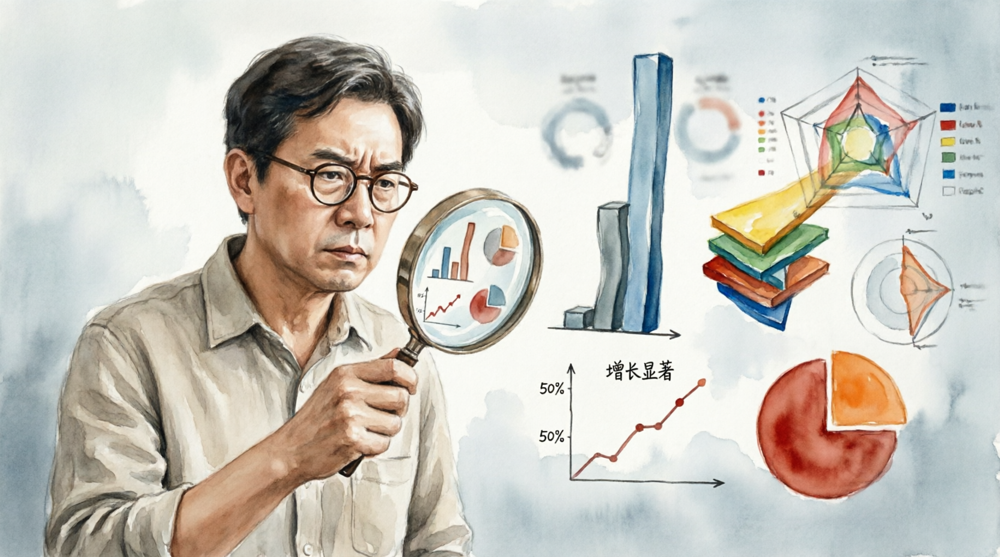

# Работа с данными и статистикой

## Что такое статистика

**Статистика** — это данные о каких-то явлениях, представленные в виде чисел.  
Она помогает анализировать события и [делать выводы](methods_of_logical_inference.md).

Статистику используют в разных областях:

- в науке  
- в экономике  
- в новостях  
- в рекламе  
- в социальных исследованиях  

Цифры часто выглядят убедительно. Но важно помнить, что **данные можно представить по-разному**, и иногда это используют для [манипуляции](manipulation_recognition.md).

---

## Статистические манипуляции

**Статистическая манипуляция** — это способ представить данные так, чтобы они поддерживали нужную точку зрения.

При этом сами цифры могут быть **правильными**, но их подача может вводить в заблуждение.

---

## Выборочная статистика

Иногда показывают **только часть данных**, которая поддерживает нужный вывод.

Например:

- показывают рост продаж только за удачный месяц  
- сравнивают только те показатели, которые выглядят выгодно  

Если посмотреть **полную статистику**, вывод может оказаться другим.

---

## Неправильные сравнения

Иногда сравнивают вещи, которые **нельзя сравнивать напрямую**.

Например:

- сравнение разных периодов времени  
- сравнение стран с сильно разным населением  
- использование разных методов подсчёта

Такие сравнения могут создавать **неправильное впечатление о данных**.

---

## Манипуляции с [графиками](information_verification.md)

Графики помогают быстро понять информацию, но их тоже можно искажать.

### Изменённая шкала

Иногда на графике **обрезают начало шкалы**.

Из-за этого небольшие изменения выглядят **очень большими**.

Например, разница между значениями 98 и 100 может выглядеть как резкий скачок.

---

### Неправильные пропорции

Иногда размеры столбцов или линий на графике **не соответствуют реальным значениям**.

Это делает различия **больше или меньше, чем они есть на самом деле**.

---

### Слишком сложные графики

Иногда графики делают очень сложными:

- много линий
- много цветов
- много показателей

В результате читателю становится трудно понять **главную идею данных**.

---

## Как правильно читать статистику

Чтобы лучше понимать данные, полезно задавать несколько вопросов:

1. **Откуда взяты данные?**
2. **Как проводилось исследование?**
3. **Показаны ли все данные или только часть?**
4. **Правильно ли построен график?**
5. **Можно ли проверить [источник](source_evaluation.md) статистики?**

---

## Итог

Статистика помогает понимать мир, но её можно использовать по-разному.

Поэтому важно:

- внимательно смотреть на источники данных  
- проверять сравнения  
- обращать внимание на графики и визуализацию  

Навык анализа данных помогает **замечать манипуляции и делать более точные выводы**.

---
Авторы: Матвей Германенко, @THENEAL24;  
*Ресурсы: LLM - ChatGPT (OpenAI)*
