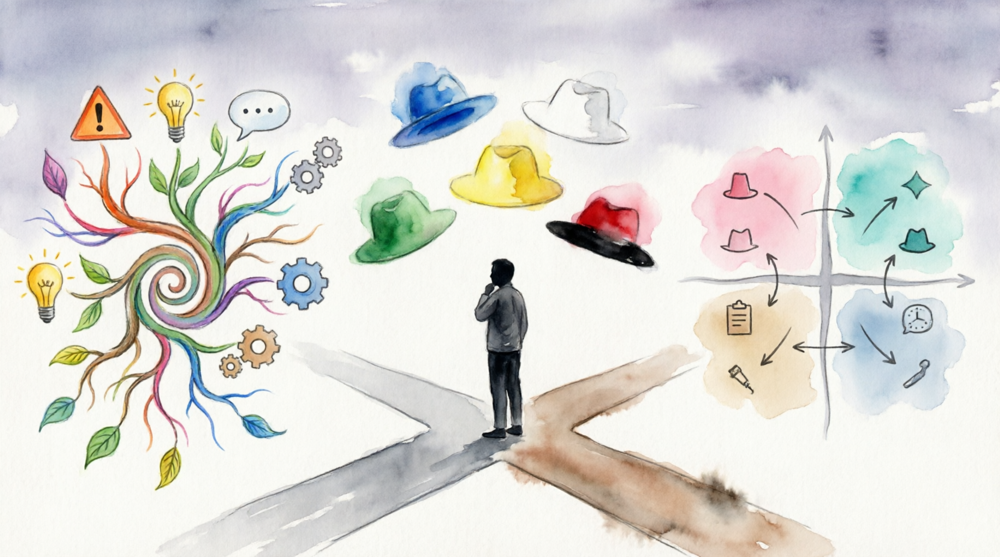

# Модели решений: Системный переход от анализа к действию

Принятие решения — это не одномоментный акт воли, а технологический процесс. Когда проблема структурирована, необходимо выбрать оптимальный путь её устранения. Использование формальных моделей позволяет минимизировать влияние [«человеческого фактора»](main_cognitive_distortions.md) — страха, предвзятости и ограниченности воображения.

---

## 1. Интеллект-карты (Mind Mapping): Проектирование ментального ландшафта

Интеллект-карты, популяризированные Тони Бьюзеном, позволяют преодолеть линейность текста. Это инструмент **радиантного мышления**, который задействует оба полушария мозга: левое (логика, слова) и правое (образы, цвет, пространство).

### Глубокий алгоритм построения:

1. **Ядро**: В центре — четко сформулированный [*Problem Statement*](structuring_the_problem.md).
2. **Первичные ветви (BOIs — Basic Ordering Ideas)**: Основные векторы движения. Например: «Техническое решение», «Организационные изменения», «Бюджет», «Риски».
3. **Ассоциативный взрыв**: От каждой ветви рисуются линии к частным идеям. Здесь важно не ограничивать себя критикой.
4. **Визуальное кодирование**:
* **Цвет**: Разные ветви — разные цвета (помогает мозгу мгновенно переключать контекст).
* **Символы**: Иконки ⚠️ для рисков, 💰 для затрат, ✅ для приоритетов.

5. **Ревизия связей**: Проведите пунктирные линии между ветвями из разных групп. Часто решение лежит на пересечении, например, «Техническая автоматизация» (ветвь А) может закрыть проблему «Нехватки персонала» (ветвь Б).

> [!TIP]
> В контексте IT и разработки Mind Maps идеально подходят для проектирования архитектуры систем или планирования путей миграции данных, где важно видеть все зависимости одновременно.

---

## 2. Матричный анализ: SWOT и его расширения

SWOT-анализ часто критикуют за поверхностность, но это происходит только если ограничиваться простым перечислением факторов. Для глубокого решения используется **Матрица SWOT-анализа**.

### Продвинутая методика (TOWS Matrix):

Вместо четырех списков мы создаем пересечения для генерации стратегий:

| Факторы | Возможности (Opportunities) | Угрозы (Threats) |
| --- | --- | --- |
| **Силы (Strengths)** | **S-O Стратегия**: «Наступление». Как использовать наши козыри для захвата новых высот? | **S-T Стратегия**: «Защита». Как наши силы могут нейтрализовать внешние риски? |
| **Слабости (Weaknesses)** | **W-O Стратегия**: «Переворот». Какие возможности помогут нам исправить внутренние дефекты? | **W-T Стратегия**: «Выживание». Как нам не дать внешним угрозам ударить по нашим слабым местам? |

---

## 3. Метод «Шести шляп»: Параллельное мышление

Метод Эдварда де Боно решает главную проблему совещаний — «спор ради спора». Вместо того чтобы один человек доказывал пользу, а другой — вред, вся команда одновременно надевает одну шляпу.

### Подробный регламент сессии:

* **Синяя (5 мин)**: Установка цели. «Сегодня мы решаем, переходить ли на новую архитектуру».
* **Белая (10 мин)**: Сбор данных. «Сколько это стоит? Какие метрики текущей системы?».
* **Зеленая (15 мин)**: Генерация идей. «Как мы можем сделать переход бесшовным? А что если использовать гибридный подход?».
* **Желтая (10 мин)**: Оценка выгод. «Это ускорит разработку на 30%, привлечет новых спецов».
* **Черная (10 мин)**: Критический фильтр. **Важно:** нельзя просто говорить «это плохо». Нужно говорить «здесь [риск потери данных](reflection_and_post-mortem.md), потому что...».
* **Красная (5 мин)**: Итоговое чувство. «После всего обсуждения, вы верите в успех?».
* **Синяя (5 мин)**: Выводы и назначение ответственных.

---

## 4. Матрица Эйзенхауэра и фильтрация решений

Когда идей много, нужно выбрать, что делать в первую очередь. Модель Эйзенхауэра делит задачи по двум осям: **Важность** и **Срочность**.

1. **Важно и Срочно (Кризис)**: Сделать немедленно. (Например: критический баг на проде).
2. **Важно, но Не срочно (Стратегия)**: Запланировать. Именно здесь рождаются качественные изменения и инновации.
3. **Не важно, но Срочно (Суета)**: Делегировать. Мелкие правки, чужие просьбы.
4. **Не важно и Не срочно (Мусор)**: Удалить.

---

## 5. [Когнитивные ловушки](main_cognitive_distortions.md) при выборе моделей

При поиске решения мозг склонен срезать углы. Модели помогают избежать следующих ловушек:

* **[Ловушка доступности](influence_of_emotions.md)**: Мы выбираем решение, которое первым пришло в голову (лечится Зеленой шляпой).
* **Эффект привязки (Anchoring)**: Первая услышанная цифра или идея доминирует над остальными (лечится Белой шляпой).
* **Смещение в сторону статус-кво**: Желание оставить всё как есть (лечится SWOT-анализом в секторе О — Возможности).

> [!IMPORTANT]
> Модели решений — это не костыли для слабых, это экзоскелет для ума. Они позволяют обрабатывать в 5–10 раз больше переменных, чем обычное линейное обсуждение.

---

Авторы: Барменков Артемий, @ArtemDelGray;

*Ресурсы: Edward de Bono "Six Thinking Hats", Michael Michalko "Thinkertoys", LLM - Gemini(Google)*
