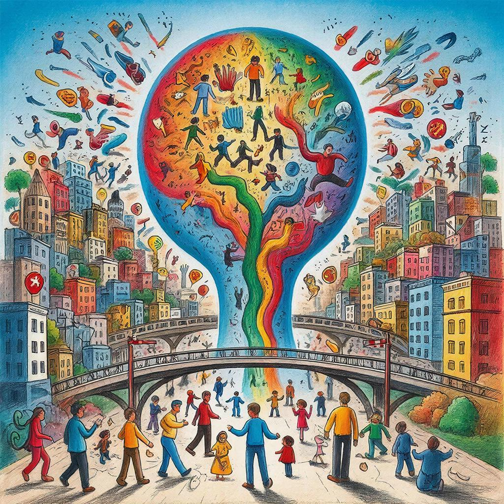

# Влияние эмоций: Как страх, надежда или симпатия заставляют нас игнорировать факты

Представь, что ты смотришь два ролика. В первом — милый котенок пытается запрыгнуть на диван и смешно падает. Во втором — скучная лекция профессора о квантовой физике. Что ты запомнишь лучше? Что вызовет у тебя больше эмоций?

Ответ очевиден: котенок. Потому что эмоции — это мощнейший усилитель внимания и памяти. Но у этой суперсилы есть обратная сторона: эмоции могут ослеплять нас, заставляя игнорировать факты и принимать иррациональные решения.

---

## Эмоции как светофор: почему они нам нужны

Прежде чем ругать эмоции, давай разберемся, зачем они вообще существуют. Эмоции — это не баг, а фича нашего организма. Психологи сравнивают их со **светофором**, который указывает нам на то, что с нами сейчас происходит.

**Эмоция** (от лат. *emovere* — возбуждать, волновать) — это реакция организма на значимые события. Когда происходит что-то важное, мозг посылает сигнал: «Обрати внимание!». Тело реагирует: сердце бьется чаще, дыхание меняется, мышцы напрягаются. Мы готовимся к действию.

Ученые выделяют 7 базовых эмоций:
- Радость и счастье
- Гнев и злость
- Отвращение
- Удивление
- Страх
- Печаль и грусть
- Презрение

Каждая из них выполняет свою функцию. Страх защищает от опасности. Гнев мобилизует силы для борьбы. Радость сигнализирует: «Все хорошо, можно расслабиться». Проблемы начинаются тогда, когда эмоции берут верх над разумом и начинают управлять нашими решениями.

---

## Почему эмоции заставляют нас игнорировать факты?

### 1. Эмоции — древнее, чем логика

Эволюционно эмоциональный мозг (лимбическая система) сформировался гораздо раньше, чем кора больших полушарий, отвечающая за [логическое мышление](methods_of_logical_inference.md). Поэтому в критической ситуации сигнал от эмоций поступает быстрее, чем от разума. Сначала мы чувствуем, а потом — думаем.

Когда мы сталкиваемся с информацией, мозг мгновенно оценивает ее эмоциональную окраску. Если информация вызывает сильную эмоцию, критическое мышление отключается. Мы перестаем задавать вопросы «А правда ли это?» и начинаем действовать под влиянием момента.

### 2. Эмоции создают иллюзию истины

Информация, окрашенная эмоциями, кажется нам более достоверной. Это называется **[эффектом доступности](decision_models.md)**. Яркие, шокирующие, страшные или радостные события легче всплывают в памяти, и мы начинаем думать, что они случаются чаще, чем на самом деле.

**Пример:** После просмотра новостей о терактах или катастрофах нам начинает казаться, что мир полон опасностей, хотя статистически вероятность погибнуть в ДТП гораздо выше. Но ДТП не показывают по телевизору каждый день, потому что это не так эмоционально.

### 3. Эмоции заставляют искать подтверждение

Когда мы испытываем сильные эмоции по поводу какой-то идеи, мы начинаем искать только ту информацию, которая ее подтверждает. Это [эффект подтверждения](main_cognitive_distortions.md), усиленный эмоциями.

**Например:** Если ты влюблен в какого-то блогера, ты будешь замечать только его хорошие поступки и игнорировать плохие. Твоя симпатия создает фильтр, через который проходит только приятная информация.

---

## Четыре главные эмоции, которые крадут наше критическое мышление

### 1. Страх: паралич разума

Страх — самая мощная эмоция с точки зрения влияния на решения. Когда мы боимся, мозг включает режим «бей или беги». Кровь отливает от «думающих» отделов мозга к мышцам. В таком состоянии анализировать факты практически невозможно.

**Как страх искажает мышление:**
- Мы переоцениваем вероятность плохих событий
- Мы соглашаемся на любые меры, которые обещают безопасность
- Мы легко верим в [теории заговора](logical_errors_and_sophisms.md) и «страшилки»
- Мы готовы отдать деньги, свободу, права ради чувства защищенности

**Жизненный пример:** Во время пандемии многие люди скупали гречку и туалетную бумагу тоннами, хотя никакого реального дефицита не было. Страх перед неизвестностью заставил игнорировать факты (в магазины регулярно завозят товары) и действовать иррационально.

### 2. Надежда: сладкий обманщик

Надежда — эмоция, которая заставляет нас видеть то, что мы хотим видеть. Она помогает выживать в трудных ситуациях, но она же мешает трезво оценивать реальность.

**Как надежда искажает мышление:**
- Мы верим в обещания, которые слишком хороши, чтобы быть правдой
- Мы игнорируем предупреждения и «красные флаги»
- Мы держимся за провальные проекты, потому что «вот-вот повезет»
- Мы покупаем лотерейные билеты, веря в миллион, а не в теорию вероятности

**Жизненный пример:** Реклама «Похудей на 10 кг за неделю без диет» работает исключительно на надежде. Факты говорят, что быстрое похудение опасно и невозможно, но надежда затмевает разум.

### 3. Симпатия: розовые очки

Симпатия, любовь, восхищение — эти эмоции заставляют нас идеализировать объект чувств. Мы перестаем замечать недостатки, а если замечаем — находим им оправдания.

**Как симпатия искажает мышление:**
- Мы доверяем привлекательным людям больше, чем непривлекательным
- Мы верим блогерам и звездам только потому, что они нам нравятся
- Мы не замечаем манипуляции от тех, кого любим
- Мы оправдываем плохие поступки «хороших» людей

**Жизненный пример:** Любимый блогер рекламирует «чудо-мазь от всех болезней». Ты покупаешь, хотя знаешь, что настоящие лекарства должны проходить клинические испытания. Твоя симпатия к блогеру перевешивает знание фактов.

### 4. Гнев: туннельное зрение

Гнев сужает внимание. В состоянии ярости мы фокусируемся на одном объекте и перестаем видеть картину целиком. Мы готовы верить любой информации, которая подтверждает нашу правоту и виновность противника.

**Как гнев искажает мышление:**
- Мы делим мир на «своих» и «чужих»
- Мы верим самым диким обвинениям в адрес тех, кого ненавидим
- Мы перестаем замечать логические ошибки в своих аргументах
- Мы поддерживаем жестокие меры против «врагов»

**Жизненный пример:** В интернет-спорах разгневанные участники часто переходят на личности ([ad hominem](logical_errors_and_sophisms.md)), вместо того чтобы обсуждать суть проблемы. Им важнее уничтожить оппонента, чем найти истину.

---

## Как эмоции манипулируют нами (приемы, которые нужно знать)

Те, кто хочет нами управлять, прекрасно знают о силе эмоций. Существуют специальные техники, которые отключают критическое мышление:

| Прием | Как работает | Пример |
|---|---|---|
| **Ярлыки** | Используются слова, вызывающие сильные эмоции и стереотипные ассоциации | Оппонента называют «мошенником» или «врагом народа» — и вот уже все его слова автоматически объявляются ложью |
| **Пафос** | Обычные события подаются как эпические, героические или чудовищные | Обычное уголовное преступление называют «борьбой с системой» или «жертвой во имя будущего» |
| **Информационный перегруз** | Постоянно вбрасываются новые порции информации, чтобы не дать времени на осмысление | В новостях мелькают десятки событий, и ни одно не анализируется глубоко |
| **Поляризация** | Мир делится только на черное и белое. Полутонов нет | «Ты либо с нами, либо против нас». «Либо ты за свободу, либо ты за угнетение» |
| **Снятие ответственности** | Вся вина возлагается на других | «Они сами виноваты, что мы так поступаем». «Это они заставили нас защищаться» |

---

## Эмоциональная регуляция: как вернуть себе разум

Хорошая новость: мы можем научиться управлять своими эмоциями, чтобы они не мешали мыслить критически. Это называется **эмоциональной регуляцией**.

Нейробиологи выяснили, что у нас есть специальные механизмы для контроля эмоций. Главную роль играет **префронтальная кора** — «начальник» мозга, который может тормозить сигналы из эмоциональных центров (например, из миндалины).

### Стратегии эмоциональной регуляции

#### 1. Когнитивная переоценка (самая эффективная)

Это умение посмотреть на ситуацию по-другому, изменить ее значение.

**Как работает:**
- Вместо «Я провалил контрольную, я тупой» → «Я получил обратную связь о том, что нужно подучить».
- Вместо «Мне сделали замечание, меня унижают» → «Мне помогают стать лучше».
- Вместо «Ужас, катастрофа» → «Интересный опыт, из которого можно извлечь урок».

Когнитивная переоценка снижает уровень тревоги и помогает увидеть больше возможностей.

#### 2. Пауза (тайм-аут)

Когда эмоции зашкаливают, самое умное — ничего не решать. Сделай паузу. Выйди из комнаты. Выпей воды. Посчитай до десяти. Подожди хотя бы 20 минут. Эмоции — это временные волны, они проходят.

> «Эмоции — это миражи сознания. Они реальны, но они не говорят нам о том, какова жизнь вокруг. Они говорят о нашем сиюминутном восприятии».

#### 3. Проверка фактов

Задай себе простые вопросы:
- «Какие у меня есть доказательства того, что это правда?»
- «Что бы я сказал другу в такой ситуации?»
- «Как на это посмотрит человек со стороны?»
- «Не преувеличиваю ли я?»

#### 4. Принятие эмоции

Иногда полезно просто признать: «Да, мне сейчас страшно. Это нормально. Но это пройдет». Попытка подавить эмоцию часто делает ее сильнее. Признание — первый шаг к контролю.

#### 5. Практика благодарности

В конце дня записывай три вещи, за которые ты благодарен. Это может быть что угодно: вкусный обед, интересный фильм, солнечная погода. Такая практика тренирует мозг замечать хорошее и не зацикливаться на негативе.

---

## Чек-лист: как не дать эмоциям обмануть тебя

Перед тем как принять важное решение, сделать репост или поверить сенсационной новости, пройди по этому списку:

| Вопрос | Что проверить |
|---|---|
| **Что я сейчас чувствую?** | Осознай свою эмоцию. Назови ее. |
| **Не слишком ли сильна эмоция?** | Если хочется бежать и делать немедленно — тормози. |
| **Не давит ли кто-то на мои чувства?** | Кому выгодно, чтобы я боялся/злился/надеялся? |
| **Какие факты я игнорирую?** | Специально поищи информацию, которая противоречит твоим чувствам. |
| **Что я подумаю об этом через неделю?** | Временная дистанция помогает увидеть ситуацию объективнее. |
| **Не делю ли я мир на черное и белое?** | Есть ли промежуточные варианты? |

---

## Главный вывод

Эмоции — не враги разума. Без эмоций мы не могли бы принимать решения вообще. Исследования показывают, что люди с поврежденными эмоциональными центрами мозга не могут сделать даже простой выбор — им все равно, что надеть или что съесть.

Проблема не в эмоциях, а в том, когда они **захватывают власть** над нашим мышлением. Мудрость не в том, чтобы не чувствовать, а в том, чтобы уметь вовремя сделать паузу, отстраниться и спросить себя: «А что здесь на самом деле происходит?».

> Как говорил один философ: «Между стимулом и реакцией есть промежуток. В этом промежутке — наша свобода». Твоя задача — научиться замечать этот промежуток и пользоваться им.

---
Авторы: Шилов Павел, @FullMaster34;  
*Ресурсы: LLM - DeepSeek*
