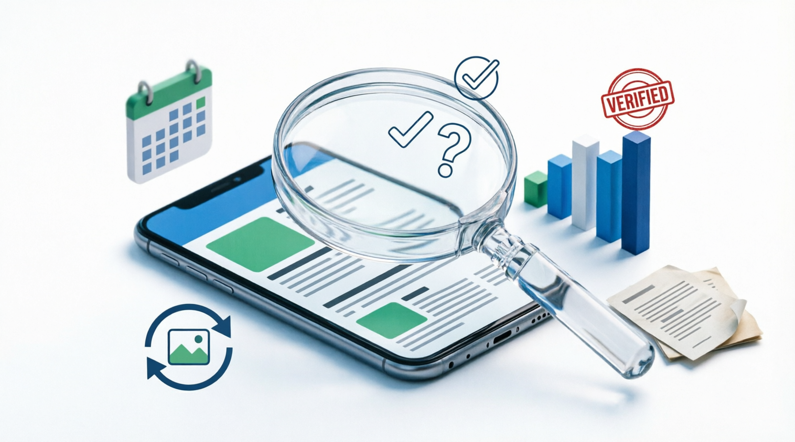

# Методы проверки достоверности информации в интернете. Основы фактчекинга: как проверять новости, фотографии и статистику, чтобы отличать правду от фейков.
## Что такое верификация информации

**Верификация** (или **[фактчекинг](source_evaluation.md)**) — это процесс проверки информации на достоверность.  
Он помогает понять, **правда ли то, что мы читаем, видим или слышим**.

Сегодня в интернете очень много новостей, фотографий и статистики. Среди них могут встречаться:

- ошибки
- вырванные из контекста факты
- фейковые новости
- специально искажённая информация

Поэтому важно уметь **проверять информацию перед тем, как ей верить или делиться с другими**.

---

## Зачем проверять информацию

Проверка информации помогает:

- не распространять фейковые новости  
- принимать правильные решения  
- отличать факты от мнений  
- понимать, когда нас пытаются ввести в заблуждение  

Например, иногда новости могут быть написаны так, чтобы **[вызвать сильные эмоции](influence_of_emotions.md)** — страх, злость или удивление. В таких случаях особенно важно проверить информацию.

---

## Как проверять новости

Есть несколько простых способов проверить новость.

### 1. Найти подтверждение в [других источниках](information_bubbles.md)

Если новость правдивая, о ней обычно пишут **несколько разных СМИ**.

Что можно сделать:
- поискать новость в интернете
- посмотреть, пишут ли о ней другие издания
- сравнить информацию

Если новость есть **только на одном сайте**, стоит относиться к ней осторожно.

---

### 2. Проверить дату

Иногда старые новости распространяют как новые.

Например:
- новость произошла **несколько лет назад**
- её публикуют снова без указания даты

Поэтому всегда стоит смотреть **дату публикации**.

---

### 3. Проверить источник

Важно понять:

- кто написал новость
- какой это сайт
- можно ли доверять этому источнику

Надёжные источники обычно:
- указывают автора
- приводят ссылки на документы или исследования
- используют проверяемые факты

---

## Как проверять фотографии

Фотографии тоже могут вводить в заблуждение.

Иногда изображение:
- сделано **в другом месте**
- сделано **в другое время**
- **изменено с помощью редакторов**

Чтобы проверить фотографию, можно:

- сделать **обратный поиск по изображению**
- посмотреть, **где она использовалась раньше**
- проверить описание и дату

Иногда оказывается, что фотография **не имеет отношения к событию**, о котором пишут.

---

## Как проверять [статистику](data_and_statistics.md)

Цифры выглядят убедительно, но ими тоже можно манипулировать.

Например:

- показывают только часть данных  
- выбирают выгодный период времени  
- сравнивают несравнимые вещи  

Чтобы проверить статистику, полезно:

- посмотреть **источник данных**
- узнать, **как проводилось исследование**
- сравнить данные с другими источниками

---

## Простое правило проверки информации

Перед тем как поверить информации или поделиться ею, задайте себе несколько вопросов:

1. **Кто это написал?**  
2. **Есть ли другие источники?**  
3. **Есть ли доказательства или ссылки на данные?**  
4. **Когда это произошло?**

Если ответы на эти вопросы **непонятны или вызывают сомнения**, лучше перепроверить информацию.

---

## Итог

В современном мире информации очень много, и не вся она правдивая.  
Навык **верификации информации** помогает:

- [отличать факты от фейков](fact_and_opinion_differences.md)
- не поддаваться манипуляциям  
- лучше понимать окружающий мир  

Умение проверять информацию — **важный навык цифровой грамотности**.

---
Авторы: Матвей Германенко, @THENEAL24;  
*Ресурсы: LLM - ChatGPT (OpenAI)*
