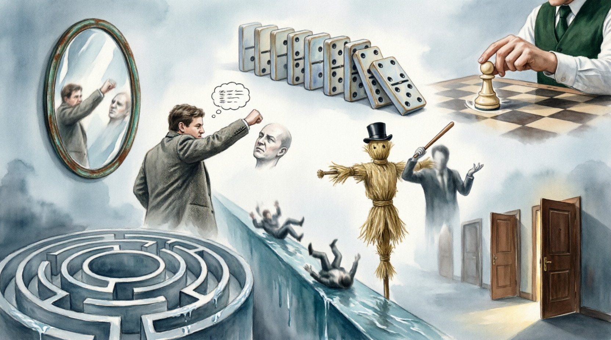

# Логические ошибки и софизмы: искусство распознавания интеллектуальных манипуляций

В процессе коммуникации и анализа информации мы часто сталкиваемся с убедительными на первый взгляд доводами, которые при детальном рассмотрении оказываются ложными. В критическом мышлении такие дефекты аргументации делятся на непреднамеренные ошибки (**паралогизмы**) и сознательные уловки, созданные для введения в заблуждение (**софизмы**). Понимание их природы — это «интеллектуальная самооборона», необходимая каждому исследователю.

---

## 1. Софизм против Паралогизма: Намерение имеет значение

**Паралогизм** — это ложный вывод, допущенный случайно, из-за невнимательности или недостатка логической грамотности. Автор сам верит в истинность своего рассуждения.

**Софизм** (от греч. *sophisma* — «хитрость, измышление») — это преднамеренное нарушение законов логики, замаскированное под внешнюю правильность. Цель софиста — не поиск истины, а победа в споре любой ценой или навязывание своей воли.

---

## 2. Подмена понятий: Главный инструмент манипуляции

Самый распространенный и опасный вид логической ошибки — это нарушение **[Закона тождества](methods_of_logical_inference.md)**. В логике каждое понятие должно использоваться в одном и том же значении на протяжении всего рассуждения.

### Эквивокация (Использование многозначности)
Это использование одного и того же слова в разных смыслах в рамках одного аргумента.
*   *Пример:* «У него очень мягкий характер. Мягкие вещи легко сжимаются. Значит, его характер легко сжать в кулак». Слово «мягкий» здесь меняет значение с психологического на физическое.

### Логомахия (Спор о словах)
Ситуация, когда спорящие используют разные определения для одного термина, из-за чего диалог теряет смысл. Без предварительного «согласования словаря» любая дискуссия обречена на превращение в софистический хаос.

---

## 3. Классификация популярных логических ошибок

Для удобства анализа разделим ошибки на группы в зависимости от того, какой элемент аргументации нарушен.

### А. Ошибки релевантности (Атака на человека вместо идеи)
1.  **[Ad Hominem](anatomy_of_argument.md) (Переход на личности)**: Утверждение, что аргумент ложен, потому что выдвинувший его человек «плохой», «необразованный» или «принадлежит к определенной группе». 
    *   *Суть:* Личность автора не влияет на истинность логического вывода.
2.  **«Соломенное чучело» (Straw Man)**: Искажение позиции оппонента до абсурдной или упрощенной версии, которую легко опровергнуть.
    *   *Пример:* — Я считаю, что детям нужно давать больше свободы. — То есть вы хотите, чтобы они бегали по стройкам и ели из мусорных баков?!
3.  **Tu Quoque («Сам такой»)**: Попытка дискредитировать аргумент, указывая на то, что сам автор не следует своим советам.

### Б. Ошибки презумпции (Ложные основания)
1.  **Ложная дилемма (Черно-белое мышление)**: Искусственное ограничение выбора двумя вариантами, когда на самом деле их гораздо больше. («Кто не с нами, тот против нас»).
2.  **Круговое рассуждение (Petitio Principii)**: Тезис доказывается через аргумент, который сам является частью тезиса. («Библия истинна, потому что это слово Божье, а мы знаем, что это слово Божье, потому что так написано в Библии»).
3.  **Скользкий путь (Slippery Slope)**: Утверждение без доказательств, что одно небольшое действие неизбежно приведет к катастрофическим последствиям. («Если мы разрешим ученикам пользоваться калькуляторами на уроках, они скоро забудут таблицу умножения, перестанут мыслить и цивилизация рухнет»).

### В. Нарушение [причинно-следственной связи](structuring_the_problem.md)
1.  **Post hoc ergo propter hoc («После этого — значит вследствие этого»)**: Ошибка, при которой временная последовательность принимается за причинную. (Петух прокукарекал, и взошло солнце. Значит, солнце встает из-за петуха).
2.  **[Ошибка выжившего](main_cognitive_distortions.md)**: Вывод делается на основе только успешных примеров («выживших»), при полном игнорировании отрицательного опыта, который может быть более массовым.

---

## 4. Как не дать себя обмануть: Стратегии защиты

Чтобы успешно противостоять софизмам и находить ошибки в информации, следует применять следующие техники:

1.  **Требуйте дефиниций**: Если чувствуете подмену понятий, попросите оппонента дать точное определение терминам, которые он использует.
2.  **Разделяйте личность и тезис**: Всегда возвращайте дискуссию к предмету спора, если оппонент переходит на «Ad Hominem».
3.  **Проверяйте логическую связку**: Спрашивайте себя: «Действительно ли Б следует из А?». Наличие двух фактов рядом не означает их связь.
4.  **[Бритва Оккама](methods_of_logical_inference.md)**: Не плодите сущности. Если объяснение требует слишком много допущений и «теорий заговора», скорее всего, оно ошибочно.

---

## Заключение

Логические ошибки окружают нас повсюду: в рекламе, политических дебатах и бытовых спорах. Умение распознавать софизмы не делает человека «занудой», оно делает его мышление устойчивым к манипуляциям. Истинная свобода выбора начинается там, где заканчивается власть ложной аргументации над нашим разумом.

---
Авторы: Дмитрий Колесник, @Frizgy;  
*Ресурсы: LLM - ChatGPT (OpenAI)*
