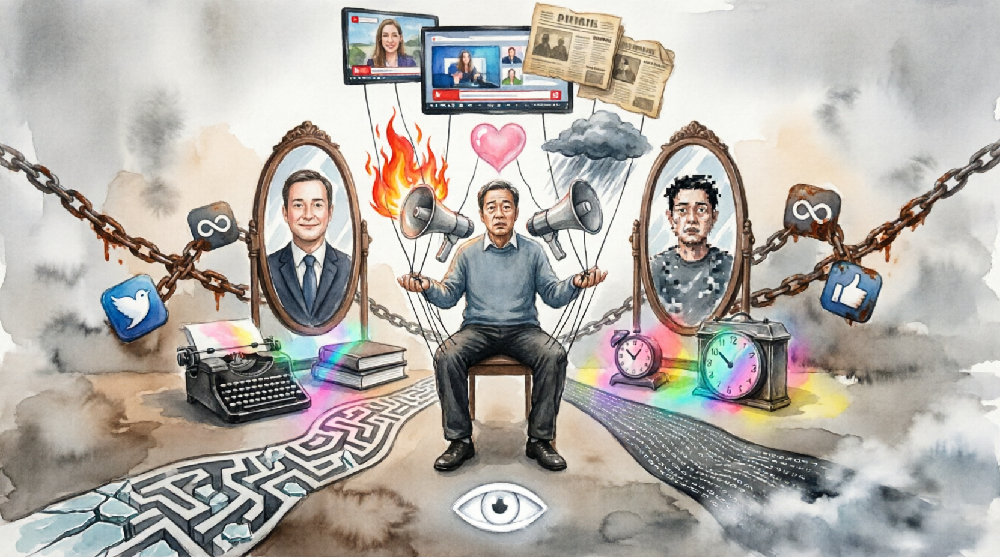

# Распознавание манипуляций в СМИ и социальных сетях

## Что такое манипуляция в медиа

**Манипуляция** — это скрытое воздействие на мнение или поведение человека, при котором автор преследует свои цели, не раскрывая их читателю или зрителю.

В отличие от честной аргументации, манипуляция не апеллирует к разуму. Вместо этого она использует:

- **эмоции** — страх, гнев, зависть, патриотизм
- **[языковые приёмы](propaganda_techniques.md)** — двусмысленные формулировки, избыточно оценочные слова
- **структуру подачи** — что показать, а что скрыть

Понять, что тебя пытаются манипулировать, — первый шаг к тому, чтобы это не сработало.

---

## Язык вражды

**Язык вражды** (hate speech) — это высказывания, которые унижают или демонизируют группу людей по какому-либо признаку: национальности, религии, полу, политическим взглядам.

### Как он работает

Язык вражды заменяет конкретных людей абстрактными образами врага. Вместо «жители этого района» — «они». Вместо «сторонники партии X» — «предатели» или «фанатики».

Это создаёт **эффект [деперсонализации](logical_errors_and_sophisms.md)**: человеку становится проще испытывать агрессию к абстрактной группе, чем к реальным людям.

### Признаки языка вражды

- Обобщения типа «все они одинаковые»
- Использование зоологических или иных унижающих метафор
- Призывы к изоляции, ограничению прав или насилию в отношении группы
- Намеренно оскорбительные наименования групп людей

---

## [Эмоционально окрашенная лексика](influence_of_emotions.md)

Слова несут не только значение, но и **эмоциональный заряд**.

Сравните два описания одного события:

| Нейтральное | Эмоционально окрашенное |
|---|---|
| Акция протеста | Беспорядки / Народное восстание |
| Солдаты противника | Террористы / Освободители |
| Рост цен на 5% | Цены выросли / Цены немного скорректировались |

Выбор слова уже формирует отношение к событию — ещё до того, как читатель успел подумать самостоятельно.

### На что обращать внимание

- Слова с явной положительной или отрицательной коннотацией там, где уместна нейтральная формулировка
- Кавычки вокруг слов («так называемый», «»эксперт«»)  — сигнал, что автор не согласен с понятием, но прямо это не говорит
- Превосходные степени без цифр: «огромный», «катастрофический», «небывалый»

---

## Пропаганда в заголовках

Заголовки — главный инструмент манипуляции в современных СМИ, потому что большинство людей читают только их.

### Типичные приёмы

**1. Риторический вопрос**
«Неужели правительство скрывает правду?» — вопрос не содержит факта, но внушает подозрение.

**2. Сенсационализм**
Преувеличение значимости события для привлечения внимания. Слова «шок», «скандал», «разоблачение» сигнализируют о том, что заголовок создан для клика, а не для информации.

**3. Неполная цитата**
Цитата вырывается из контекста так, что меняет смысл сказанного. Всегда полезно найти полный текст или запись высказывания.

**4. Пассивный залог без субъекта**
«Данные были скрыты» — кем? Когда? Такие формулировки создают ощущение заговора, не называя конкретных виновных.

---

## Манипуляции в социальных сетях

Социальные сети создают особую среду для манипуляций:

- **Скорость распространения**: фейк расходится быстрее опровержения
- **Алгоритмический отбор**: система показывает то, что вызывает сильную реакцию
- **Эффект социального доказательства**: если пост лайкнули тысячи — «значит, правда»

### Признаки манипулятивного контента в соцсетях

- Призывы «поделиться, пока не удалили»
- Ссылки на анонимные [источники](source_evaluation.md) («источники в правительстве», «знакомый врач»)
- Мемы, упрощающие сложные темы до одного тезиса
- Ботовая активность: аккаунты без истории, одинаковые комментарии

---

## Как защититься от манипуляций

1. **Делайте паузу** перед тем, как поделиться материалом — особенно если он вызывает сильные эмоции
2. **Проверяйте источник**: кто написал, когда, с какой целью
3. **Ищите оригинал**: цитаты, цифры и фотографии часто искажаются при пересказе
4. **Сравнивайте несколько источников** с разными точками зрения
5. **Разделяйте [факты и оценки](fact_and_opinion_differences.md)** — задавайте вопрос: «Это описание событий или их интерпретация?»

---

## Итог

Манипуляции в медиа существуют, потому что они работают. Язык вражды, эмоционально окрашенные слова и вводящие в заблуждение заголовки — всё это инструменты, рассчитанные на автоматическую реакцию, а не на осмысление.

Распознать манипуляцию — значит сделать шаг от реакции к анализу. Этот навык не появляется сам по себе, но тренируется с каждым прочитанным материалом.

---
*Авторы: Османова Виктория, @kosmichka152331*  
*Ресурсы: LLM — Claude (Anthropic)*
