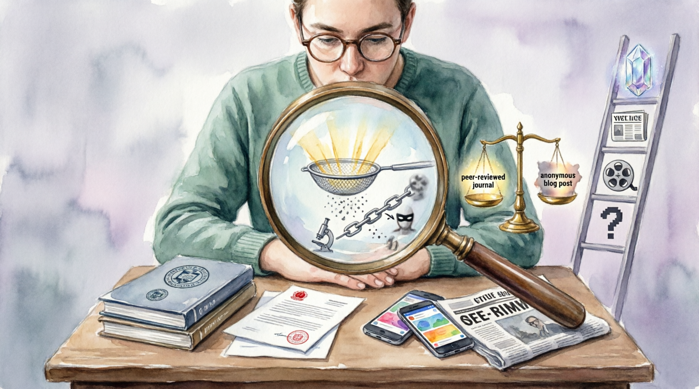

# Как оценивать источники информации.

## Что такое источник информации

**Источник информации** — это место, откуда мы получаем данные, новости или знания.

Источником может быть:

- статья на сайте
- научная публикация
- книга
- интервью
- статистический отчёт
- пост в социальных сетях

Не все источники одинаково надёжны. Поэтому важно уметь [**оценивать качество источника**](information_verification.md).

---

## Основные критерии оценки источника

Чтобы понять, можно ли доверять информации, обычно проверяют несколько критериев.

1. авторитетность источника  
2. независимость  
3. первичность или вторичность источника  
4. наличие конфликта интересов  

---

## Авторитетность источника

**Авторитетность** показывает, насколько автор или организация компетентны в теме.

Например:

- [научную информацию](data_and_statistics.md) лучше получать от учёных и научных организаций  
- медицинские советы — от врачей и медицинских учреждений  
- новости — от известных и проверенных СМИ  

Если автор неизвестен, не указывает образование или опыт, доверять такой информации стоит осторожно.

### Что можно проверить

- указан ли **автор статьи**
- есть ли у автора **опыт или образование в теме**
- является ли сайт **известным источником**

---

## Независимость источника

**Независимый источник** — это источник, который не связан напрямую с объектом, о котором пишет.

Например:

- обзор телефона от независимого журналиста
- исследование университета
- статья аналитического центра

Менее независимым может быть:

- реклама компании о собственном продукте
- статья на сайте компании о своей же деятельности

Независимые источники обычно **более [объективны](fact_and_opinion_differences.md)**.

---

## Первичные и вторичные источники

Источники информации делятся на **первичные** и **вторичные**.

### Первичный источник

**Первичный источник** — это информация из первых рук.

Примеры:

- научное исследование
- официальный документ
- статистический отчёт
- интервью с участником события

### Вторичный источник

**Вторичный источник** — это пересказ или анализ первичного источника.

Примеры:

- новостная статья о научном исследовании
- обзор исследования
- аналитическая статья

Вторичные источники могут быть полезны, но иногда они **упрощают или искажают информацию**.

---

## Конфликт интересов

**Конфликт интересов** возникает, когда автор может получить выгоду от определённого результата или мнения.

Например:

- компания публикует исследование, которое показывает, что её продукт лучший
- блогер рекламирует товар и получает за это деньги
- организация финансирует исследование о своей деятельности

Это не значит, что информация обязательно ложная, но **её нужно проверять особенно внимательно**.

---

## Простые вопросы для проверки источника

Перед тем как доверять информации, можно задать себе несколько вопросов:

1. **Кто автор?**
2. **Есть ли у автора опыт в этой теме?**
3. **Независим ли источник?**
4. **Это первичная информация или пересказ?**
5. **Есть ли у автора личная выгода?**

Если источник отвечает этим критериям, вероятность того, что информация **достоверна**, становится выше.

---

## Итог

Умение оценивать источники помогает:

- отличать надёжную информацию от сомнительной
- избегать [манипуляций](manipulation_recognition.md)
- лучше понимать новости и исследования

Критическое отношение к источникам — важный навык [**цифровой грамотности**](information_bubbles.md).

---
Авторы: Матвей Германенко, @THENEAL24;  
*Ресурсы: LLM - ChatGPT (OpenAI)*
