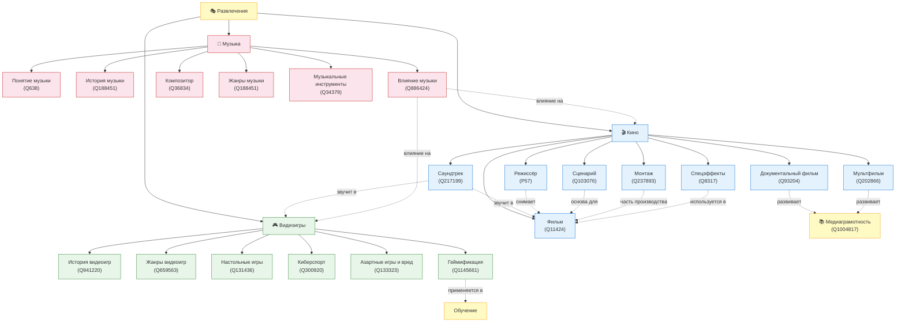

# Развлечения: игры, фильмы и музыка — баланс пользы и развлечения

## Описание направления

Раздел детской энциклопедии, посвящённый играм, фильмам и музыке. Основная идея — объяснить ребёнку 10 лет, что развлечения могут быть не только весёлыми, но и полезными, а также научить находить баланс между удовольствием и пользой.

## Онтология предметной области

### Визуализация (Mermaid)



### Описание связей

| Тип связи | Обозначение | Примеры |
|-----------|-------------|---------|
| **Иерархическая** (подвид / включает) | Сплошная линия → | Развлечение → Фильм; Фильм → Мультфильм |
| **Горизонтальная** (влияет / использует) | Пунктирная линия -.-> | Фильмы ↔ Игры (экранизации); Песня → Фильм (саундтрек) |
| **Функциональная** (требует / развивает) | Пунктирная линия -.-> | Развлечение → Медиаграмотность |

### Список понятий

| # | Понятие | WikiData | Категория | Файл |
|---|---------|----------|-----------|------|
| 1 | История видеоигр | [Q941220](https://www.wikidata.org/wiki/Q941220) | Игры | `articles/history-of-games.md` |
| 2 | Жанры видеоигр | [Q659563](https://www.wikidata.org/wiki/Q659563) | Игры | `articles/game-genres.md` |
| 3 | Настольные игры | [Q131436](https://www.wikidata.org/wiki/Q131436) | Игры | `articles/board-games.md` |
| 4 | Киберспорт | [Q300920](https://www.wikidata.org/wiki/Q300920) | Игры | `articles/esports.md` |
| 5 | Азартные игры и их вред | [Q133323](https://www.wikidata.org/wiki/Q133323) | Игры | `articles/gambling-and-harm.md` |
| 6 | Геймификация | [Q1145661](https://www.wikidata.org/wiki/Q1145661) | Игры | `articles/gamification.md` |
| 7 | Композитор | [Q36834](https://www.wikidata.org/wiki/Q36834) | Музыка | `articles/composer.md` |
| 8 | Жанры музыки | [Q188451](https://www.wikidata.org/wiki/Q188451) | Музыка | `articles/music_genres.md` |
| 9 | Музыкальные инструменты | [Q34379](https://www.wikidata.org/wiki/Q34379) | Музыка | `articles/musical_instruments.md` |
| 10 | Понятие музыки и её устройство | [Q638](https://www.wikidata.org/wiki/Q638) | Музыка | `articles/music.md` |
| 11 | История музыки | [Q188451](https://www.wikidata.org/wiki/Q188451) | Музыка | `articles/history_of_music.md` |
| 12 | Влияние музыки на человека | [Q886424](https://www.wikidata.org/wiki/Q886424) | Музыка | `articles/psychology_of_music.md` |
| 13 | Режиссёр | [P57](https://www.wikidata.org/wiki/Property:P57) | Фильмы | `articles/director.md` |
| 14 | Сценарий | [Q103076](https://www.wikidata.org/wiki/Q103076) | Фильмы | `articles/script.md` |
| 15 | Саундтрек | [Q217199](https://www.wikidata.org/wiki/Q217199) | Фильмы | `articles/soundtrack.md` |
| 16 | Фильм | [Q11424](https://www.wikidata.org/wiki/Q11424) | Фильмы | `articles/movie.md` |
| 17 | Спецэффекты | [Q8317](https://www.wikidata.org/wiki/Q8317) | Фильмы | `articles/special_effects.md` |
| 18 | Монтаж | [Q237893](https://www.wikidata.org/wiki/Q237893) | Фильмы | `articles/montage.md` |
| 19 | Мультфильм | [Q202866](https://www.wikidata.org/wiki/Q202866) | Фильмы | `articles/animation.md` |
| 20 | Документальный фильм | [Q93204](https://www.wikidata.org/wiki/Q93204) | Фильмы | `articles/documentary.md` |
| 21 | Медиаграмотность | [Q1004817](https://www.wikidata.org/wiki/Q1004817) | Общее | `articles/media_literacy.md` |

## Источники знаний

### WikiData / SPARQL

Для каждого понятия из таблицы выше были извлечены данные из WikiData с помощью SPARQL-запросов:
- Метки и описания на русском/английском языках
- Иерархические связи (P279 — subclass of, P31 — instance of)
- Связанные сущности (P136 — жанр, P737 — influenced by и др.)

Скрипт: [`wikidata_extract.py`](wikidata_extract.py)

Результаты: директория [`wikidata/`](wikidata/)

### Генерация текстов

Тексты энциклопедических статей сгенерированы с помощью **GigaChat API** (модель GigaChat, бесплатный лимит GIGACHAT_API_PERS).

Промпт-шаблон:
> **Системный**: "Ты автор детской энциклопедии для восьмиклассников. Пиши просто, интересно и понятно для десятилетнего ребёнка. Пиши развёрнуто, подробно раскрывая каждый раздел."
>
> **Пользователь**: "Напиши подробную статью для детской энциклопедии о понятии «{понятие}». Тема раздела: «Игры, фильмы и музыка: баланс пользы и развлечения». Описание: {description}. Содержание: введение, история, виды, интересные факты (3-5), примеры из жизни, польза, риски, баланс, заключение. Используй WikiData: {wikidata_context}. Ответ в формате markdown."

Параметры: `temperature=0.7`, `max_tokens=3000`

Скрипт: [`generate_pages.py`](generate_pages.py)

### Перекрёстные ссылки

Ссылки между понятиями расставлены автоматически скриптом [`crosslink.py`](crosslink.py), который:
1. Загружает `concepts.json` со всеми падежными формами понятий
2. В каждом markdown-файле находит вхождения форм других понятий
3. Заменяет первое вхождение каждого понятия на markdown-ссылку `[форма](файл.md)`
4. Не заменяет понятие внутри собственной статьи и в заголовках

Для работы с падежами используется библиотека `pymorphy3`.

## Как запустить

```bash
# 1. Установить зависимости
pip install -r requirements.txt

# 2. Создать файл .env и задать ключ авторизации GigaChat
#    (получить на https://developers.sber.ru/studio/)

# 3. Извлечь данные из WikiData
python wikidata_extract.py

# 4. Сгенерировать статьи через GigaChat
python generate_pages.py

# 5. Расставить перекрёстные ссылки
python crosslink.py
```

## Участники группы

| # | ФИО | Понятия |
|---|-----|---------|
| 1 | Долбус Дмитрий | История видеоигр, Жанры видеоигр, Настольные игры, Киберспорт, Азартные игры и их вред, Геймификация |
| 2 | Хабирова Амина | Композитор, Жанры музыки, Музыкальные инструменты |
| 3 | Канева Юлия | Понятие музыки и её устройство, История музыки, Влияние музыки на человека |
| 4 | Хереш Артемий | Режиссёр, Сценарий, Саундтрек |
| 5 | Фролов Матвей | Фильм, Спецэффекты, Монтаж |
| 6 | Глушко Игорь | Мультфильм, Документальный фильм, Медиаграмотность |
